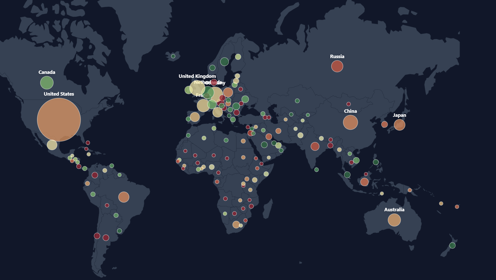

# Global Data Center Landscape Dashboard 🌍

An interactive data visualization tool that maps the global distribution of data centers, analyzing infrastructure volume against renewable energy adoption rates.

## 🚀 Overview

This dashboard visualizes global data center metrics to highlight the balance between digital infrastructure growth and sustainability. It serves as both an analytical tool and a presentation aid.

Key Metrics Visualized:

1. Volume (Circle Size): Represents the total number of data centers in a country.

2. Sustainability (Color Gradient): Indicates the percentage of renewable energy usage (Red = Low, Green = High).

## 📊 Data Source

Dataset Source: Kaggle - Data Center Dataset (https://www.kaggle.com/datasets/rockyt07/data-center-dataset)

## ✨ Features

Interactive World Map:

Scroll-to-Zoom: Seamless zooming and panning to explore specific regions.

Smart Centroids: Custom coordinate logic ensures data points for countries like Norway and the USA appear on landmasses, not in the ocean.

Slide Mode: A distinct toggle that removes UI clutter (toolbars/menus) and maximizes the map, designed specifically for taking screenshots or presenting live.

Deep Dive Tooltips: Hover over any country to reveal granular data:

Total Facilities

Hyperscale Data Center count

Power Capacity (MW)

Key Local Operators

Top 10 Hubs: A dynamic bar chart at the bottom ranking the countries with the largest infrastructure.

## 🛠️ How to Run

This project is built as a single-file application. It does not require npm, Node.js, or a build process.

Download the index.html file from this repository.

Open the file directly in any modern web browser (Chrome, Edge, Firefox, Safari).

The application will automatically fetch the required libraries (React, D3, Tailwind) via CDN.

## 📦 Technologies Used

React (via CDN): Component-based UI logic.

D3.js: Advanced geographic projections, coordinate scaling, and zoom behaviors.

TopoJSON: Efficient encoding for the world map topology.

Tailwind CSS (via CDN): Rapid, responsive styling.

Lucide Icons: Visual iconography.

## 🌐 Hosting on GitHub Pages

You can view this map live without downloading it by hosting it on GitHub Pages:

Go to this repository's Settings.

Click on Pages in the left sidebar.

Under Source, select main (or master) from the dropdown menu and click Save.

GitHub will provide a URL (e.g., https://your-username.github.io/repo-name/) where your map is live!

## 📄 License

This project is open-source and available under the MIT License.

